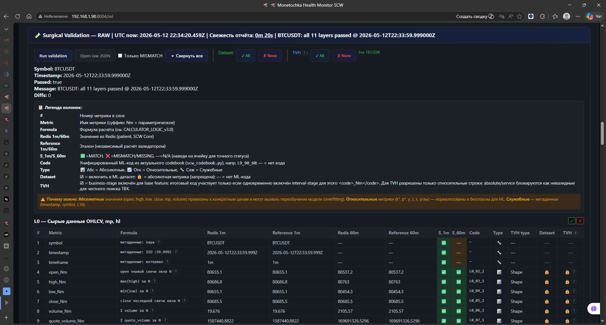
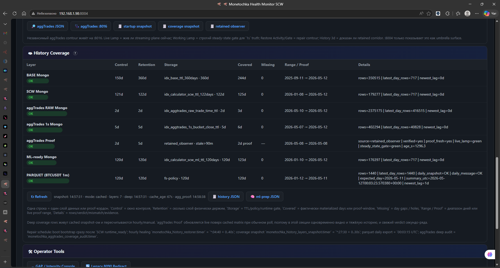
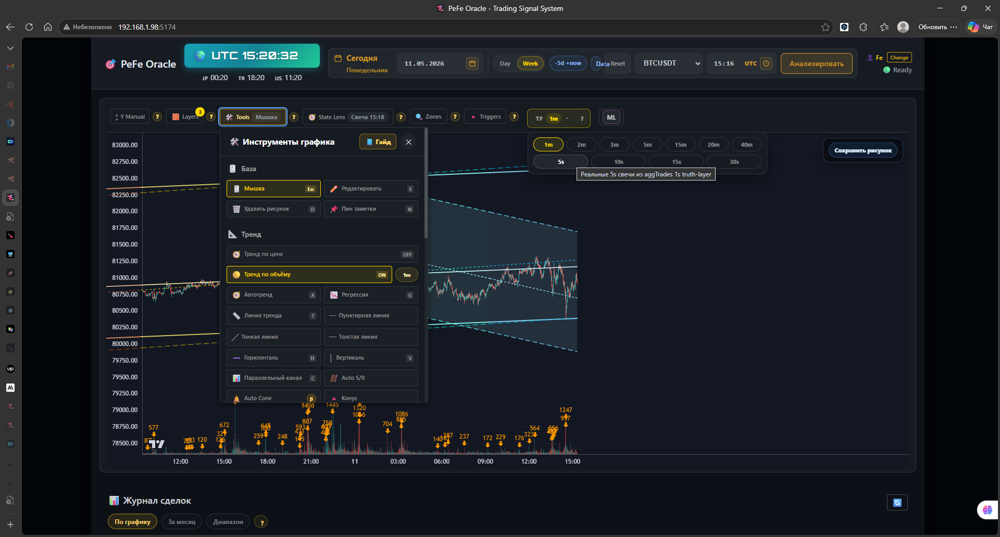
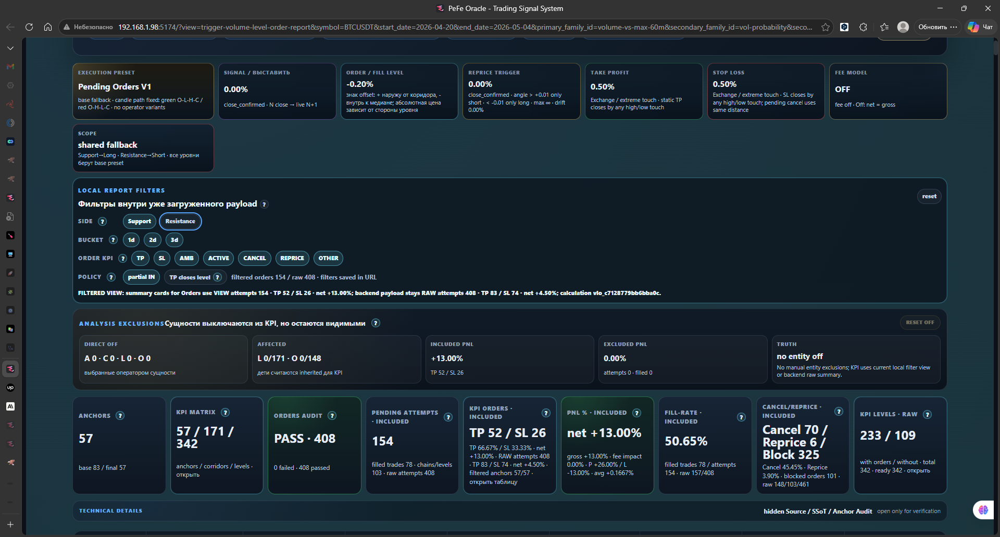
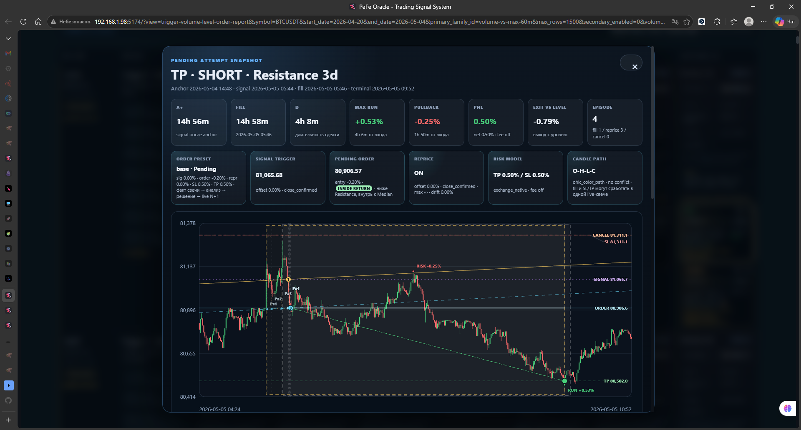
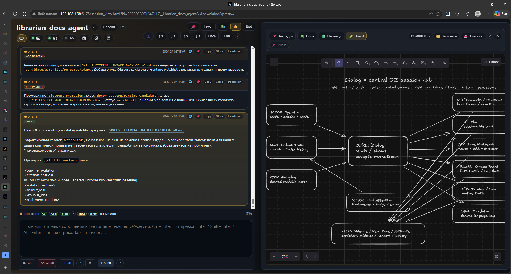
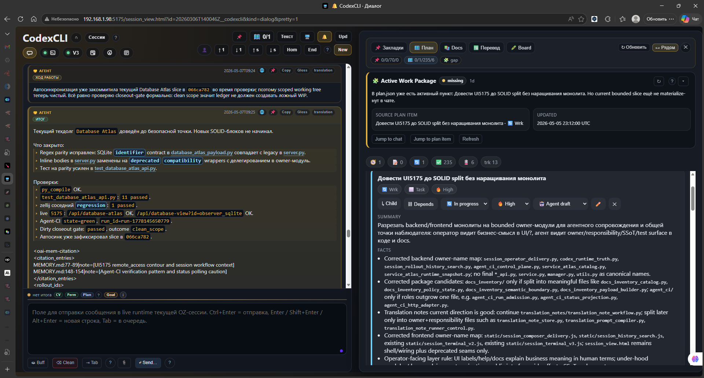

# Time-Series Core Showcase

Backend data infrastructure, time-series validation and operational analytics.

- **Author:** Fedor Gorbunov
- **Focus:** Python backend · real-time streams · data quality · analytics workflows
- **Location:** Antalya, Turkey · open to relocation

This is a public portfolio repository. It does not publish the private
production source code, trading logic, credentials or runtime internals. It
shows the architecture, screenshots and technical documents that describe the
work.

## What This Shows

The project uses market data as a noisy real-time testbed. The same engineering
problems appear in fintech, risk systems, IoT, operations and monitoring:

- unreliable streams;
- gaps and duplicate events;
- state drift between storage layers;
- historical recovery;
- data-quality gates before analytics;
- dashboards and human review when automation is not enough.

The main point is backend reliability first: collect the signal, verify it,
recover gaps, expose health, then build analysis and ML on top.

## Core Backend Pipeline

| Layer | What it demonstrates |
|---|---|
| Ingestion | WebSocket/REST market-data intake, reconnect/recovery model |
| Buffering | Redis ZSET runtime buffers for recent time-series state |
| Persistence | MongoDB state storage and Parquet snapshots |
| Validation | source-trust checks, duplicate/gap detection, multi-layer validation |
| Recovery | automated backfill/recalculation when history is incomplete |
| Observability | Prometheus/Grafana/Loki style health, coverage and runtime reports |
| Analytics output | validated state slices for review, reports and later ML experiments |

Technical overview:
[Real-Time Data Pipeline - Source Trust & Recovery](docs/Real-Time_Data_Pipeline_Source_Trust_and_Recovery_Overview.pdf)

Public proof slice:

- `src/time_series_core/` - domain models, synthetic generator and validator;
- `examples/validate_synthetic_series.py` - CLI report for clean/defective data;
- `tests/test_validator.py` - minimal regression tests for trusted, gap and
  duplicate cases.

Run it:

```bash
python3 examples/validate_synthetic_series.py
python3 examples/validate_synthetic_series.py --gap-at 20 --duplicate-at 40
PYTHONPATH=src python3 -m unittest discover -s tests
```





## Analytics / Review Surface

The UI layer is used to inspect validated time-series events, review state
transitions and compare automated decisions with chart context. The screenshots
are shown as evidence of workflow and data review, not as trading advice or an
investment product.

Technical overview:
[Analytics UI - Human-in-the-Loop Review Workflow](docs/Analytics_UI_Human_in_the_Loop_Review_Workflow.pdf)







## AI-Assisted Engineering Layer

The AI/operator cockpit is secondary in this repository. It is included because
the same system was used to run long engineering sessions, keep runtime truth
visible and preserve artifacts around implementation work.

Technical overview:
[AI Agent Operator Cockpit](docs/AI_Agent_Operator_Cockpit_Technical_Overview.pdf)





## Tech Stack

```text
Backend:       Python 3.12, FastAPI, asyncio
Data:          MongoDB 7.0, Redis, Apache Parquet
Streaming:     WebSocket, REST, ZeroMQ
Validation:    NumPy vectorized checks, state fingerprints
Observability: Prometheus, Grafana, Loki, custom health monitors
Frontend:      React, TradingView Charting Library, custom reports
AI tooling:    Codex CLI, operator cockpit, session artifacts
```

## What Is Not Public Here

- private repository source code;
- strategy rules, thresholds and proprietary formulas;
- API keys, credentials, account data or private runtime logs;
- customer/private data;
- complete production deployment details.

## Next Public Proof Slices

The next useful public additions should be small and verifiable:

1. FastAPI/asyncio service skeleton with health checks, source-trust status and
   recovery-state model.
2. CLI or notebook report for coverage, missing intervals and data-quality
   metrics.
3. ML-ready export example after the backend/time-series proof is solid.

ML is intentionally not the headline yet. The current headline is reliable
time-series infrastructure and analysis.
